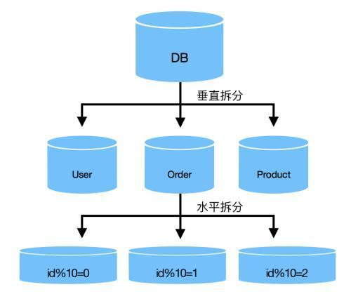
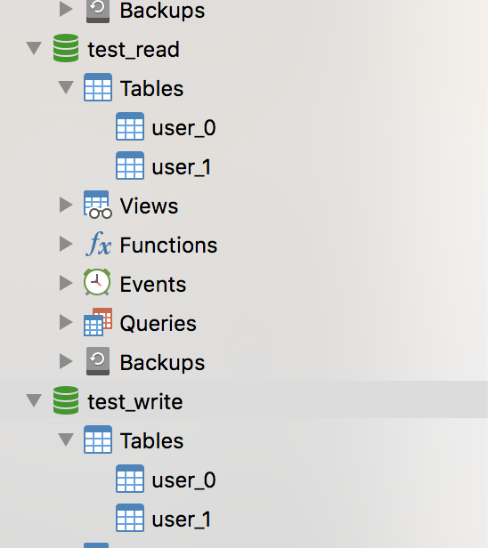
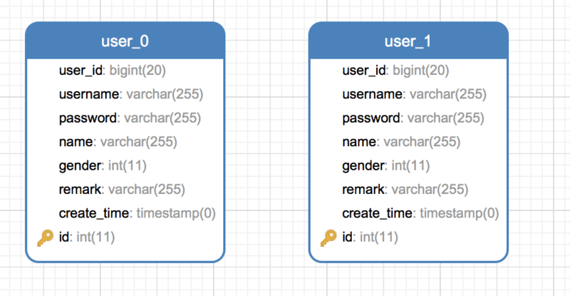
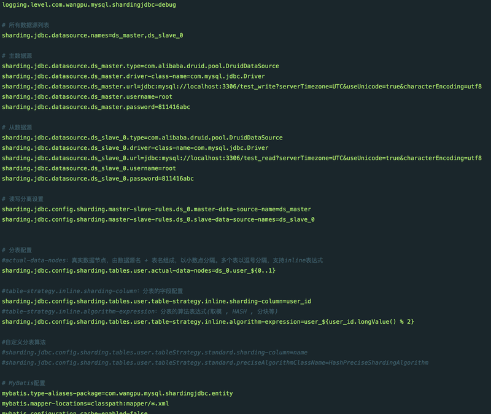

##项目背景

 - 关系型数据库本身比较容易成为系统瓶颈，单机存储容量、连接数、处理能力都有限。当单表的数据量达到1000W或100G以后，由于查询维度较多，即使添加从库、优化索引，做很多操作时性能仍下降严重。此时就要考虑对其进行切分了，切分的目的就在于减少数据库的负担，缩短查询时间。

 - 数据库分布式核心内容无非就是数据切分（Sharding），以及切分后对数据的定位、整合。数据切分就是将数据分散存储到多个数据库中，使得单一数据库中的数据量变小，通过扩充主机的数量缓解单一数据库的性能问题，从而达到提升数据库操作性能的目的。

  




 - 数据切分根据其切分类型，可以分为两种方式：

     - **垂直（纵向）切分**：垂直分库就是根据业务耦合性，将关联度低的不同表存储在不同的数据库。
     - **水平（横向）切分**：水平切分分为库内分表和分库分表，是根据表内数据内在的逻辑关系，将同一个表按不同的条件分散到多个数据库或多个表中，每个表中只包含一部分数据，从而使得单个表的数据量变小，达到分布式的效果。


**垂直分表**是基于数据库中的"列"进行，某个表字段较多，可以新建一张扩展表，将不经常用或字段长度较大的字段拆分出去到扩展表中。在字段很多的情况下（例如一个大表有100多个字段），通过"大表拆小表"，更便于开发与维护，也能避免跨页问题，MySQL底层是通过数据页存储的，一条记录占用空间过大会导致跨页，造成额外的性能开销。

另外数据库以行为单位将数据加载到内存中，这样表中字段长度较短且访问频率较高，内存能加载更多的数据，命中率更高，减少了磁盘IO，从而提升了数据库性能。

- *垂直切分的优点*：
     - 解决业务系统层面的耦合，业务清晰；
     - 与微服务的治理类似，也能对不同业务的数据进行分级管理、维护、监控、扩展等；
     - 高并发场景下，垂直切分一定程度的提升IO、数据库连接数、单机硬件资源的瓶颈。

- *缺点*：
     - 部分表无法join，只能通过接口聚合方式解决，提升了开发的复杂度；
     - 分布式事务处理复杂；
     - 依然存在单表数据量过大的问题（需要水平切分）。


**库内分表**只解决了单一表数据量过大的问题，但没有将表分布到不同机器的库上，因此对于减轻MySQL数据库的压力来说，帮助不是很大，大家还是竞争同一个物理机的CPU、内存、网络IO，最好通过分库分表来解决。

- *水平切分的优点*：

     - 不存在单库数据量过大、高并发的性能瓶颈，提升系统稳定性和负载能力；

     - 应用端改造较小，不需要拆分业务模块。

- *缺点*：
     - 跨分片的事务一致性难以保证；

     - 跨库的join关联查询性能较差；

     -  数据多次扩展难度和维护量极大。

水平切分后同一张表会出现在多个数据库/表中，每个库/表的内容不同。几种典型的数据分片规则为：

- **根据数值范围**

  - 按照时间区间或ID区间来切分。例如：按日期将不同月甚至是日的数据分散到不同的库中；将userId为1~9999的记录分到第一个库，10000~20000的分到第二个库，以此类推。某种意义上，某些系统中使用的"冷热数据分离"，将一些使用较少的历史数据迁移到其他库中，业务功能上只提供热点数据的查询，也是类似的实践。

**优点**：

  - 单表大小可控；

  - 天然便于水平扩展，后期如果想对整个分片集群扩容时，只需要添加节点即可，无需对其他分片的数据进行迁移；

  - 使用分片字段进行范围查找时，连续分片可快速定位分片进行快速查询，有效避免跨分片查询的问题。

**缺点**：

  - 热点数据成为性能瓶颈。连续分片可能存在数据热点，例如按时间字段分片，有些分片存储最近时间段内的数据，可能会被频繁的读写；而有些分片存储的历史数据，则很少被查询。

- **根据数值取模**

  - 一般采用hash取模mod的切分方式。例如：将 Customer 表根据 cusno 字段切分到4个库中，余数为0的放到第一个库，余数为1的放到第二个库，以此类推。这样同一个用户的数据会分散到同一个库中，如果查询条件带有cusno字段，则可明确定位到相应库去查询。

**优点**：

-  数据分片相对比较均匀，不容易出现热点和并发访问的瓶颈。

**缺点**：

-  后期分片集群扩容时，需要迁移旧的数据（使用一致性hash算法能较好的避免这个问题）；

-  容易面临跨分片查询的复杂问题。比如上例中，如果频繁用到的查询条件中不带cusno时，将会导致无法定位数据库，从而需要同时向4个库发起查询，再在内存中合并数据，取最小集返回给应用，分库反而成为拖累。


**同时分库分表带来了下列问题**：

- 事务一致性问题
  - 分布式事务
  - 最终一致性

- 跨节点关联查询 join 问题

- 跨节点分页、排序、函数问题

- 全局主键避重问题

- 数据迁移、扩容问题

下边用 Sharding-JDBC ，这种方式，无需额外部署，无其他依赖，DBA也无需改变原有的运维方式。可靠性还是很好的。

下边的id主键,我这里没有处理，大家在实际工程中一定要生成唯一的id.

##1、数据库准备
```
CREATE TABLE `user_x` (
  `user_id` bigint(20) DEFAULT NULL,
  `username` varchar(255) CHARACTER SET utf8mb4 COLLATE utf8mb4_unicode_ci DEFAULT NULL,
  `password` varchar(255) CHARACTER SET utf8mb4 COLLATE utf8mb4_unicode_ci DEFAULT NULL,
  `name` varchar(255) CHARACTER SET utf8mb4 COLLATE utf8mb4_unicode_ci DEFAULT NULL,
  `gender` int(11) DEFAULT NULL,
  `remark` varchar(255) CHARACTER SET utf8mb4 COLLATE utf8mb4_unicode_ci DEFAULT NULL,
  `create_time` timestamp NULL DEFAULT NULL,
  `id` int(11) NOT NULL AUTO_INCREMENT,
  PRIMARY KEY (`id`) USING BTREE
) ENGINE=InnoDB AUTO_INCREMENT=3 DEFAULT CHARSET=utf8mb4 COLLATE=utf8mb4_unicode_ci;
```







##2、pom.xml配置

```
<dependencies>
        <!-- web支持 -->
        <dependency>
            <groupId>org.springframework.boot</groupId>
            <artifactId>spring-boot-starter-web</artifactId>
        </dependency>
        <!-- mySql 驱动 -->
        <dependency>
            <groupId>mysql</groupId>
            <artifactId>mysql-connector-java</artifactId>
            <version>5.1.46</version>
        </dependency>
        <!-- mybatis sprongBoot支持 -->
        <dependency>
            <groupId>org.mybatis.spring.boot</groupId>
            <artifactId>mybatis-spring-boot-starter</artifactId>
            <version>1.3.2</version>
        </dependency>
        <!-- druid数据支持 -->
        <dependency>
            <groupId>com.alibaba</groupId>
            <artifactId>druid</artifactId>
            <version>1.1.12</version>
        </dependency>
        <!-- sharding-jdbc 分库分表 -->
        <dependency>
            <groupId>io.shardingjdbc</groupId>
            <artifactId>sharding-jdbc-spring-boot-starter</artifactId>
            <version>2.0.0.M3</version>
        </dependency>

        <!-- fastjson -->
        <dependency>
            <groupId>com.alibaba</groupId>
            <artifactId>fastjson</artifactId>
            <version>1.2.52</version>
        </dependency>


        <!-- lombok注解 , 简化代码 -->
        <dependency>
            <groupId>org.projectlombok</groupId>
            <artifactId>lombok</artifactId>
            <optional>true</optional>
        </dependency>

        <!-- test支持 -->
        <dependency>
            <groupId>org.springframework.boot</groupId>
            <artifactId>spring-boot-starter-test</artifactId>
            <scope>test</scope>
        </dependency>
    </dependencies>
```

##3、application.properties配置

```
logging.level.com.wangpu.mysql.shardingjdbc=debug

# 所有数据源列表
sharding.jdbc.datasource.names=ds_master,ds_slave_0

# 主数据源
sharding.jdbc.datasource.ds_master.type=com.alibaba.druid.pool.DruidDataSource
sharding.jdbc.datasource.ds_master.driver-class-name=com.mysql.jdbc.Driver
sharding.jdbc.datasource.ds_master.url=jdbc:mysql://localhost:3306/test_write?serverTimezone=UTC&useUnicode=true&characterEncoding=utf8
sharding.jdbc.datasource.ds_master.username=root
sharding.jdbc.datasource.ds_master.password=811416abc

# 从数据源
sharding.jdbc.datasource.ds_slave_0.type=com.alibaba.druid.pool.DruidDataSource
sharding.jdbc.datasource.ds_slave_0.driver-class-name=com.mysql.jdbc.Driver
sharding.jdbc.datasource.ds_slave_0.url=jdbc:mysql://localhost:3306/test_read?serverTimezone=UTC&useUnicode=true&characterEncoding=utf8
sharding.jdbc.datasource.ds_slave_0.username=root
sharding.jdbc.datasource.ds_slave_0.password=811416abc

# 读写分离设置
sharding.jdbc.config.sharding.master-slave-rules.ds_0.master-data-source-name=ds_master
sharding.jdbc.config.sharding.master-slave-rules.ds_0.slave-data-source-names=ds_slave_0


# 分表配置
#actual-data-nodes：真实数据节点，由数据源名 + 表名组成，以小数点分隔。多个表以逗号分隔，支持inline表达式
sharding.jdbc.config.sharding.tables.user.actual-data-nodes=ds_0.user_${0..1}

#table-strategy.inline.sharding-column：分表的字段配置
sharding.jdbc.config.sharding.tables.user.table-strategy.inline.sharding-column=user_id
#table-strategy.inline.algorithm-expression：分表的算法表达式(取模 , HASH , 分块等)
sharding.jdbc.config.sharding.tables.user.table-strategy.inline.algorithm-expression=user_${user_id.longValue() % 2}

#自定义分表算法
#sharding.jdbc.config.sharding.tables.user.tableStrategy.standard.sharding-column=name
#sharding.jdbc.config.sharding.tables.user.tableStrategy.standard.preciseAlgorithmClassName=HashPreciseShardingAlgorithm

# MyBatis配置
mybatis.type-aliases-package=com.wangpu.mysql.shardingjdbc.entity
mybatis.mapper-locations=classpath:mapper/*.xml
mybatis.configuration.cache-enabled=false
```




##3、接口调用


##4、数据库表现


